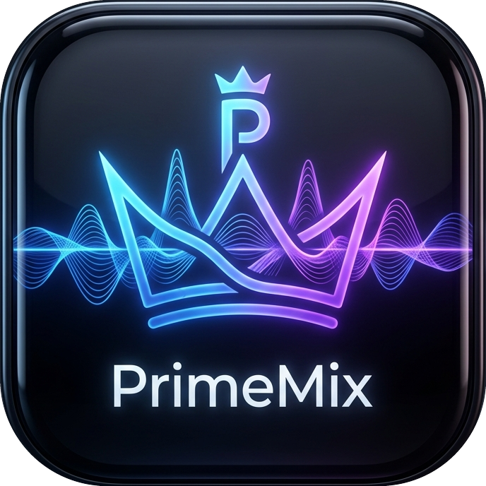

<p align="center">
  
</p>

<h1 align="center">SereneMix</h1>

<p align="center">
  <strong>Premium Ambient Sound Mixer for Windows Desktop</strong>
</p>

<p align="center">
  <a href="https://opensource.org/licenses/MIT"></a>
  <a href="https://www.electronjs.org/"></a>
  
</p>

<br>

**SereneMix** is a lid by Microsoft Store's Ambie app, it allows you to play multiple relaxing sounds simultaneously, adjust their individual volume levels, save custom mixes, set a sleep timer, and customize titles and cover art.

It features a real-time directory watcher, allowing you to drop new audio files (.mp3, .wav, .ogg, .flac, .m4a) directly into your local sounds folder and listen to them instantly without restarting the app.

---

## Key Features 🚀

- **Simultaneous Audio Playback**: Listen to multiple nature or white noise sounds at the same time to create your perfect ambient atmosphere.
- **System Tray Integration**: SereneMix minimizes to the system tray so it can run and play sounds in the background. Right-click the tray icon to play/stop all sounds or exit.
- **Multi-language Support (EN/TR)**: Toggle between English and Turkish languages dynamically. The interface, settings, and sound names/categories translate instantly, and the system tray menu synchronizes with the active language.
- **Premium Glassmorphic UI**: Enjoy a gorgeous, fully borderless window with a dedicated custom titlebar for native double-click to maximize/restore, smooth hover animations, custom equalizer wave visuals, and dynamic CSS gradients.
- **Real-time Folder Syncing**: Simply drag and drop your music/ambient audio files into the configured folder, and they will show up instantly in the app grid.
- **Sleep Timer (Fade-out)**: Fall asleep peacefully. Set a sleep timer from 15 minutes to 2 hours. When the time runs out, the volume fades out smoothly over 3 seconds before stopping.
- **Saved Mixes**: Save your favorite combinations of sounds and volume configurations so you can restore them with a single click.
- **Customizable Sounds**: Personalize sound titles, assign categories, and upload custom cover art directly within the application.

---

## Screenshots & Icons 📸

<p align="center">
  
</p>

---

## Getting Started 🛠️

### Prerequisites
Make sure you have [Node.js](https://nodejs.org/) installed on your machine.

### Installation

1. Clone or download this repository:
   ```bash
   git clone https://github.com/MaximusPrime77/SereneMix.git
   cd SereneMix
   ```
2. Place your ambient sound files in the target directory:
   `C:\Users\MAXIMUS\PROJECTS\SereneMixSound`
   *(Or modify `main.js` to change the `SOUNDS_DIR` path to your preference)*.
3. Install dependencies:
   ```bash
   npm install
   ```

### Running the App
Start the app in development mode:
```bash
npm start
```

### Packaging / Building Portable Executable
To package the app into a single, standalone, portable `.exe` file for Windows:
```bash
npm run build
```
Once the build completes, your portable executable will be located in the `dist/` directory.

> [!IMPORTANT]
> **How to Run the App:**
> 
> ### 📌 For Portable Version (`SereneMix.1.0.0.portable.exe`):
> - **Dedicated Folder Required:** To avoid cluttering your Desktop or Downloads folder, you **must** place `SereneMix.1.0.0.portable.exe` inside a dedicated empty folder (e.g., `C:\Apps\SereneMix\`) before running it. When executed, it will automatically create a folder named `SereneMix_Data` in the same directory to store your audio files, custom cover art, and configuration data.
> - **First Launch Delay:** On the very first launch, the application will take a few seconds to extract and copy the default sounds to the `SereneMix_Data` folder. Please wait patiently for a few seconds for the setup to complete.
> - **Portability:** If you want to carry your custom sounds and configurations to another computer, simply copy both the `.exe` file and its adjacent `SereneMix_Data` folder together.
> 
> ### 📌 For Zip Version (`SereneMix-1.0.0-win.zip`):
> - **No Setup Delay:** This compressed archive already contains the application files and the pre-packaged `SereneMix_Data` folder with all default sounds.
> - **Running:** Simply extract the `.zip` file to any directory and double-click `SereneMix.exe` inside the extracted folder. All sounds will be immediately available without any setup delay.

---

## Project Structure 📁

```
SereneMix/
├── package.json        # Build config & dependencies
├── main.js             # Electron main process (system tray, window, IPC, file watcher)
├── preload.js          # Electron secure IPC bridge
├── app_icon.png        # High-res 256x256 app logo
├── tray_icon.png       # 32x32 transparent tray icon
└── renderer/           # Frontend assets
    ├── index.html      # UI Layout
    ├── styles.css      # Custom glassmorphic styling
    └── app.js          # Playback logic, timer, state management & UI interactions
```

---

## Technologies Used 💻

- **Electron** (v31.0.0)
- **Node.js** (Native `fs` module & directory watching)
- **HTML5 Audio API** (Looping, play/pause controls, volume mapping)
- **Vanilla CSS** (Custom CSS Gradients, Glassmorphism, Backdrop filters)

---

## Author 👤

Developed and designed with ❤️ by **Maximus Decimus Meridius**
- **GitHub**: [@MaximusPrime77](https://github.com/MaximusPrime77)
- **Email**: b.maximus.prime@gmail.com

---

## License 📄

This project is licensed under the MIT License - see the [LICENSE](LICENSE) file for details.
